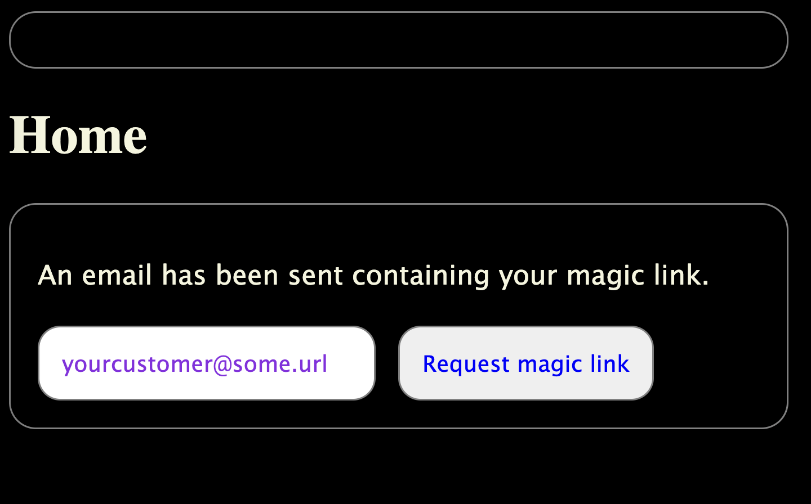
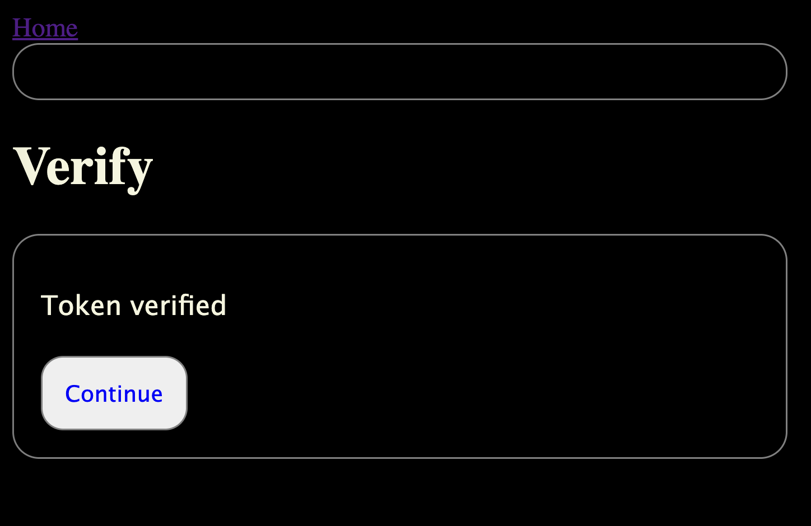
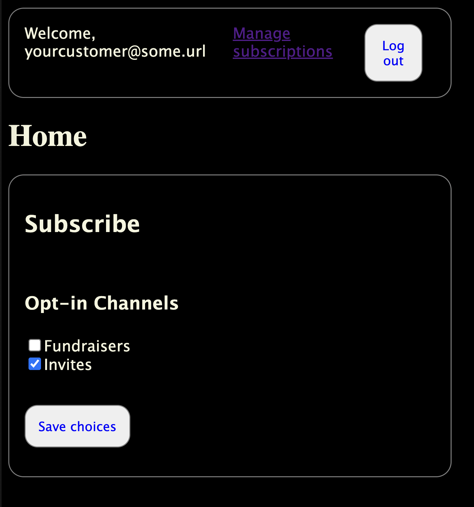

# Payload Subscribers Plugin

A plugin to manage subscribers and the "channels" they can subscribe to.

This includes ways to allow your subscribers to:

- Sign up or sign in by requesting a magic link email
- Verify the magic link to authenticate
- Opt in or out of "opt-in channels"

You manage the opt-in channels via the Payload admin.

The plugin relies on your email adapter configured in your payload config to send emails.

That is all this plugin does currently. Potential features might include email authoring and send scheduler or simple CRM features.

## Installation

```bash
pnpm add payload-subscribers-plugin
```

## Usage

You need to have an email adapter configured in your Payload config.

Add the plugin to your Payload config.

```typescript
// payload.config.ts

export default buildConfig({
  plugins: [
    payloadSubscribersPlugin({

      // Add slugs of your collections which should have a relationship field to the optInChannels.
      collections: {
        posts: true,
      },

      // Easily disable the collection logic.
      disabled: false,

      // Specify the collection to use as the subscribers collection
      //  - Optional. If not specified, the plugin will add a 'subscribers' collection.
      //  - Sets auth if not already
      //  - Adds (or overrides) fields: email, firstName, status, optIns,
      //    verificationToken, verificationTokenExpires, and source
      subscribersCollectionSlug?: CollectionSlug

      // Provide a custom expiration for magic link tokens. The default is 30 minutes.
      tokenExpiration: 60 * 60,

      // Provide your unsubscribe route. This route should include the Unsubscribe component.
      unsubscribeUrl?: string
    }),
  ],
})
```

Place the **SubscriberProvider** at the a good location in your app structure. For example, in your root layout:

```typescript
// layout.tsx

import { SubscriberProvider } from 'payload-subscribers-plugin/ui'

const Layout: React.FC<{ children: React.ReactNode }> = ({ children }) => {
  return (
    <html lang="en">
      <head></head>
      <body>
        <SubscriberProvider>
          ...
        </SubscriberProvider>
      </body>
    </html>
  )
}
```

Then you can use the components in your app:

```typescript
// page.tsx

import { RequestOrSubscribe } from 'payload-subscribers-plugin/ui'

const Page = () => {
  return (
    <main>
      <RequestOrSubscribe
        classNames={{ button: 'customCssClassNames', container: 'customCssClassNames', emailInput: 'customCssClassNames' }}
      />
    </main>
  )
}
```

**_IMPORTANT:_** Be sure to create a /verify route

```typescript
// verify/page.tsx

import { VerifyClient } from '@/components/VerifyClient.js'

const Page = () => {
  return (
    <main id="main-content">
      <VerifyMagicLink
        classNames={{ button: 'customCssClassNames', container: 'customCssClassNames', emailInput: 'customCssClassNames' }}
      />
    </main>
  )
}
```

## 🟢🔵🔴 Features

### 🟢 Plugin options

#### **collections**

You can specify collections in the plugin options which will be amended to include a relationTo field referring to the optInChannels collection. Right now this does not override the plugin-added subscribers collection, which is still used for the primary record of subscribers and used for authentication. The collections amended with an optIns can be used, for example, to manage your subscription channels and any email campaigns related.

#### **disabled**

#### **tokenExpiration**

### 🟢 Collections

#### **optInChannels**

Seeded when plugin inits.

- Fields
  - title: text
  - description: text
  - active: boolean
  - slug: text

#### **subscribers**

Seeded when plugin inits.

- Fields
  - email: text
  - first name: text
  - status: Subscribed | Unsubscribed | Pending verification (default)
  - opt-ins: referenceTo optInChannels hasMany
  - source: text
  - verificationToken: text hidden

---

### 🔵 Fields

#### **OptedInChannels**

_THE FIELD SPEC IS CURRENTLY NOT EXPORTED_ Documenting here in case that seems useful in the future.

This is the same field used by the plugin **collections** to amended a relationTo field referring to the optInChannels collection.

---

### 🔴 Payload endpoints

#### **requestMagicLink**

Takes an email, verifies it, registers it if unknown, constructs a magic link, and uses your Payload emailAdapter to sendEmail.

#### **verifyMagicLink**

Takes an email and token, verifies the token, and authenticates the user, using Payload's HTTP-only cookies auth.

#### **getOptInChannels**

Returns all active optInChannels data.

#### **subscribe** a user, or update a subscriber's opt-ins.

Takes an email and list of optInChannel IDs, verifies them, and if the authenticated subscriber matches the email will update the channels that subscriber is opted into.

#### TO DO: unsubscribe

The **subscribe** endpoint will remove all optIns. But need a way to set the subscriber status to "unsubscribed"

---

### 🟢 SubscriberProvider provider with useSubscriber context

---

### 🔵 Provides several NextJS client components ready for use in a frontend app

- All App Components are client components that consume hooks, server components, server functions. Including the useSubscriber context, and so the must be used within the children descendent tree of the SubscriberProvider provider.

- All App Components accept a **classNames** prop to specify CSS class names to add to the different parts of the component

#### **RequestOrSubscribe**

Shows the [Subscribe](#subscribe) component to authenticated subscribers, otherwise shows [RequestMagicLink](#RequestMagicLink).

<!-- <div style="border: 1px solid #ccc; padding: 15px; border-radius: 5px;">
</div> -->

```typescript
  <RequestOrSubscribe
    // Provide the URL the user should go to after clicking the link in the email and having it verified
    afterVerifyUrl={new URL(window.href)}
    // Provide your own global class names to add to the component elements. Optional
    classNames={{
      button: 'customCssClassNames',
      container: 'customCssClassNames',
      emailInput: 'customCssClassNames',
      error: 'customCssClassNames',
      form: 'customCssClassNames',
      loading: 'customCssClassNames',
      message: 'customCssClassNames',
      section: 'customCssClassNames',
    }}
    // Called after a subscribers opt-ins have been updated. Optional
    handleMagicLinkRequested={async (result: RequestMagicLinkResponse) => {}}
    // Called after a subscribers opt-ins have been updated. Optional
    handleSubscribe={async (result: SubscribeResponse) => {}}
    // Provided your own button component. Optional
    renderButton={({ name, onClick, text }) =>
      <button name={name} onClick={onClick} type="button">
        {text}
      </button>
    }
    // Provide the URL to your route that has the VerifyMagicLink component on it.
    verifyUrl={verifyUrl}
  />
```

#### **RequestMagicLink**

Form to input email address and get a magic link email sent.



```typescript
  <RequestMagicLink
    // Provide the URL the user should go to after clicking the link in the email and having it verified
    afterVerifyUrl={new URL(window.href)}
    // Provide your own global class names to add to the component elements. Optional
    classNames={{
      button: 'customCssClassNames',
      container: 'customCssClassNames',
      emailInput: 'customCssClassNames',
      error: 'customCssClassNames',
      form: 'customCssClassNames',
      message: 'customCssClassNames',
    }}
    // Called after a subscribers opt-ins have been updated. Optional
    handleMagicLinkRequested={async (result: RequestMagicLinkResponse) => {}}
    // Provided your own button component. Optional
    renderButton={({ name, onClick, text }) =>
      <button name={name} onClick={onClick} type="button">
        {text}
      </button>
    }
    // Provide the URL to your route that has the VerifyMagicLink component on it.
    verifyUrl={verifyUrl}
  />
```

```html
<!-- The HTML scaffolding with global CSS classes you can use -->
<div class="subscribers-request subscribers-container">
  <p class="subscribers-message subscribers-error">{result}</p>
  <form class="subscribers-form">
    <input class="subscribers-emailInput" type="email" />
    <button class="subscribers-button">Request magic link</button>
  </form>
</div>
```

#### **VerifyMagicLink**

Component that verifies a magic link using expected url parameters.



```typescript
  <VerifyMagicLink
    // Provide your own global class names to add to the component elements. Optional
    classNames={{
      button: 'customCssClassNames',
      container: 'customCssClassNames',
      error: 'customCssClassNames',
      form: 'customCssClassNames',
      loading: 'customCssClassNames',
      message: 'customCssClassNames',
    }}
    // Called after a magic link email has been sent. Optional
    handleMagicLinkRequested={async (result: RequestMagicLinkResponse) => {}}
    // Called after a magic link has been verified. Optional
    handleMagicLinkVerified={async (result: RequestMagicLinkResponse) => {}}
    // Provided your own button component. Optional
    renderButton={({ name, onClick, text }) =>
        <button name={name} onClick={onClick} type="button">
          {text}
        </button>
    }
    // Provide the URL to your route that has the VerifyMagicLink component on it.
    // Used when this VerifyMagicLink component provides an option to request another link
    // when verifying the current one fails.
    verifyUrl={verifyUrl}
  >
    // Provide children to render after link is verified. Optional
    // Since you provide the verifyUrl to any of the plugin components, you can include a forwardUrl
    // as a search param, which your route can then use here.
    <a href={forwardUrl}>
      <button className={'customCss'} name={'continue'} type="button">
        Continue
      </button>
    </a>
  </VerifyMagicLink>
```

```html
<!-- The HTML scaffolding with global CSS classes you can use -->
<div class="subscribers-verify subscribers-container">
  <p class="subscribers-loading">verifying...</p>
  <p class="subscribers-message">{result}</p>
  <div class="subscribers-form">
    {renderButton({ name: "request", onClick: handleRequestAnother, text:"Request another magic
    link", })} {children}
  </div>
</div>
```

#### **Subscribe**

Allows a subscriber to select from among all active optInChannels.



```typescript
  <Subscribe
    // Provide the URL the user should go to after clicking the link in the email and having it verified
    afterVerifyUrl={new URL(window.href)}
    // Provide your own global class names to add to the component elements. Optional
    classNames={{
      button: 'customCssClassNames',
      container: 'customCssClassNames',
      emailInput: 'customCssClassNames',
      error: 'customCssClassNames',
      form: 'customCssClassNames',
      loading: 'customCssClassNames',
      message: 'customCssClassNames',
      section: 'customCssClassNames',
    }}
    // Called after a subscribers opt-ins have been updated. Optional
    handleSubscribe={async (result: SubscribeResponse) => {}}
    // Provided your own button component. Optional
    renderButton={({ name, onClick, text }) =>
      <button name={name} onClick={onClick} type="button">
        {text}
      </button>
    }
    // Provide the URL to your route that has the VerifyMagicLink component on it.
    verifyUrl={verifyUrl}
  />
```

```html
<!-- The HTML scaffolding with global CSS classes you can use -->
<div class="subscribers-subscribe subscribers-container">
  <h2>Subscribe</h2>
  <div class="subscribers-section">
    <!-- START: SelectOptInChannels -->
    <div class="subscribers-container">
      <h3>Opt-in Channels</h3>
      <p class="subscribers-loading">verifying...</p>
      <div class="subscribers-optionsGroup">
        <!-- START: FOR EACH CHANNEL -->
        <div class="subscribers-optInCheckboxItem">
          <label class="subscribers-optInCheckboxLabel" ,>
            <input class="subscribers-optInCheckbox" type="checkbox" />
            {channel.title}
          </label>
        </div>
        <!-- END: FOR EACH CHANNEL -->
      </div>
    </div>
    <!-- END: SelectOptInChannels -->
  </div>
  <form class="subscribers-form">
    <div class="subscribers-section">
      <input class="subscribers-emailInput" placeholder="enter your email" type="email" />
      <button class="subscribers-button" type="submit">Save choices</button>
    </div>
  </form>
  <p class="subscribers-message subscribers-error">{result}</p>
</div>
```

#### **SubscriberMenu**

A simple user menu, most useful for testing. Seen in the screenshots above. Includes a "welcome" message, a link to a /subscribe route, and a log out button.

```typescript
// classNames prop

<SubscriberMenu
  classNames={{
    button: 'customCssClassNames',
    container: 'customCssClassNames',
  }}
  subscribeUrl={new URL('/subscribe', serverURL)}
 />

```

```html
<!-- The HTML scaffolding with global CSS classes you can use -->
<div class="subscribers-menu subscribers-container">
  <div class="subscribers-group">
    <div class="subscribers-welcome">Welcome, {subscriber email}</div>
    <div class="subscribers-subs-link">
      <a href="{subscribeUrl}">Manage subscriptions</a>
    </div>
    <div class="subscribers-logout">
      <button class="subscribers-button" type="button">Log out</button>
    </div>
  </div>
</div>
```

#### **Unsubscribe**

A component that uses URL parameters to execute the /api/unsubscribe end point. Should be used on your own route, as specified in the **unsubscribeUrl** plugin option.

```typescript
// classNames prop

      <Unsubscribe
        classNames={{ button: 'customCss', container: 'customCss', emailInput: 'customCss' }}
        handleUnsubscribe={handleUnsubscribe}
      >
      // <!-- children are rendered after unsubscribe is successful -->
        <a href={'/subscribe'}>
          <button className={'customCss'} name={'resubscribe'} type="button">
            Resubscribe
          </button>
        </a>
      </Unsubscribe>

```

```html
<!-- The HTML scaffolding with global CSS classes you can use -->
<div class="subscribers-container">
  <!-- While loading -->
  <p class="subscribers-loading">unsubscribing...</p>
  <!-- After loading -->
  <p class="subscribers-message">{result}</p>
  <div class="subscribers-form">{children}</div>
</div>
```

## Contributing

Community contributions are welcome! I haven't organized around that yet, so let me know if you're interested by opening an issue on the GitHub repo.
